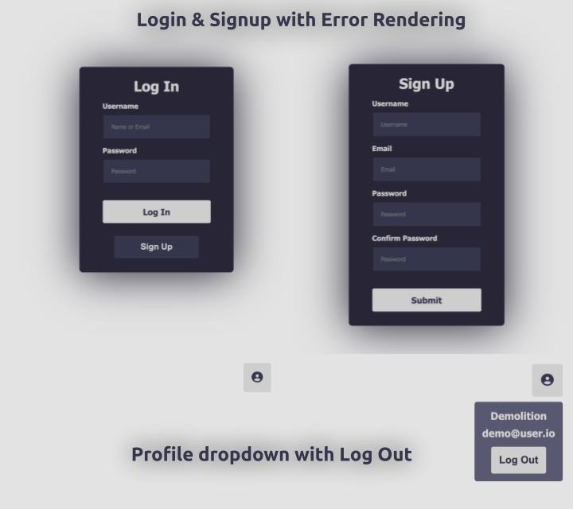

# Authenticate Me

This is an auth app using Rails, React, and Redux.

The app features pages for signing up, logging in, and a homepage logout dropdown. It handles account creation as well as session/csrf token management.

# Getting Started

## Dependencies

- Node LTS (18.3)
- Ruby 3.1.2

## Install and Run Locally

- `git clone https://github.com/zacgra/authenticate-me`
- `cd authenticate-me`
- `bundle install`
  This project isn't set up with Rails to handle the JS bundling, so you'll need to build it by:
- `cd frontend`
- `npm run build`
  Now move back to your /authenticate-me root folder and run:
- `bundle exec rails s`

You should be able to see the app in your browser at either localhost:5000 or 127.0.0.1:5000

My Project Takeaways:
This was a tough project when it came down to handling redux with the session and csrf tokens. I felt pretty good about it up until it got to the "restoring a session token" for moving auth between tabs. Also, I felt really clumsy with my CSS as it had been a while since I'd dont frontend.
